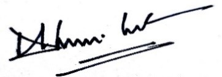

<div style="text-align:center"></div>

## <center> UCD Analytics Research & Implementation MIS40750 </center>

### <center> Programming Assignment </center>

#### <center> Submission Date : 24th Feb, 2017 </center>
#### <center> MSc Buiness Anaytics - Full Time </center>
### Authors :
|Name  | Student Number |
|:------:|:--------------:|
|Deepak Kumar Gupta| 16200660|
|Shruti Goyal      | 16200726|

### Statement of Authorship
“We declare that all of the undersigned have contributed to this work and
that it is all our own work as understood by UCD policies on Academic
Integrity and Plagiarism, unless otherwise cited”.

1. **Signature :**  

     Student Name :  DEEPAK KUMAR GUPTA

     Student Number : 16200660

2. **Signature :**  

     Student Name :  SHRUTI GOYAL

     Student Number : 16200726

<br><br>

   ----
## Introduction

 The objective of this assignment is to write a python program for an airline to allocate seats to passengers when they make a booking. Seating configuration and number of bookings have been provided to us. Our task is to read the .CSV file from the SQL database and then assign the desired number of seats to the passengers based on the criteria that passengers from the same booking should be seated as close as possible and if not they should be seperated from each other. For the successful creation of the program, it was required of us to insert the seating configuration into SQL database with passenger names alongwith their seat number and update two metrices that represents "Total number of passengers refused of securing seats in plane" and "Total number of passengers seated away from each other in a booking".

 The desired python program was successfully implemented and this report will discuss the approach followed while creating the program, challenges faced, testing file and alternative approach.

<br><br>
## Coding Structure

 1. Object oriented programming has been used to form the program structure and code has been segregated using classes. Program has been divided into 6 classes and functionality of each class will be discussed in the following sections.
 2. Matrices (numpy array) has been used to store the seat allocation information (i.e. Seat number and row number) based on the data in .csv file (i.e. bookings.csv). Matrices allow fast processing time compared to lists and dictionaries.
 3. Data structure such as lists and arrays has been used to store the values as per the requirement of the program.

<br><br>

## Method

 1. Seating configuration has been read from SQL database and a seat map has been generated using matrices where 0 represents empty seat and 1 represents occupied seat.
 2. After seat map has been generated, value of parameters (Passenger Name and Number of passengers) has been read from bookings.csv file.
 3. Based on number of passengers in a booking allocation has been done using following :
    * Case 1 : When the number of passengers in a booking is equal to 1
    * Case 2 : When the number of passengers in a booking are greater than 1 but less than or equal to total number of seats in a row of the airplane.
    * Case 3 : When the number of passengers in a booking are greater than total number of seats in a row of airplane.
 4. Appropriate split has been performed whenever passenger in a same party cannot be seated together then the maximum possible passengers alloted seats together and remaining alloted seats using Case 1 algorithm.
 5. For each seat has been allocated to a passenger, seat matrix, empty seat tracker and database are being updated. 
 
 Note : We have used below sql query for updating seat and row of passenger after seat allocation, instead of using UPDATE sql query  as discussed with professor over email.
```sql
sql = ''' INSERT INTO seating (name, row,seat) VALUES (? , ? ,? );'''
```

 6. If passenger has been refused to make booking then passenger_refused metric has been updated. 
 7. Similarly, whenever there is a split in booking passenger_seated_away metric has been updated.
 8. After all the bookings has been made (when the airplane is full) seat map is being print as below. 

 Seat Map:
```{code}
1  [' Kristen  ' ' Kristen  ' ' Kristen  ' '  Albert  ']
2  ['   Cruz   ' '   Cruz   ' '   Cruz   ' '  Albert  ']
3  ['  Robert  ' '  Robert  ' '  Robert  ' '   Ana    ']
4  ['  Joseph  ' '  Joseph  ' '  Joseph  ' '   Ana    ']
5  [' Heather  ' ' Heather  ' ' Heather  ' '   Ana    ']
6  ['  Henry   ' '  Henry   ' '  Henry   ' '  Amber   ']
7  ['  Martha  ' '  Martha  ' '  Martha  ' '  Kelly   ']
8  [' Lissette ' ' Lissette ' ' Lissette ' '  Kelly   ']
9  ['  Kirby   ' '  Kirby   ' '  Kirby   ' '  Kelly   ']
10 [' William  ' ' William  ' ' William  ' '  Ralph   ']
11 ['   Max    ' '   Max    ' '   Max    ' '  Ralph   ']
12 ['  Aaron   ' '  Aaron   ' 'Christophe' 'Christophe']
13 ['   Glen   ' '   Glen   ' '   Earl   ' '   Earl   ']
14 ['  Gladys  ' '  Gladys  ' '  Scott   ' '  Scott   ']
15 ['  Nikki   ' '  Nikki   ' '   Juan   ' '   Juan   ']
```
 9. Passenger refused and passenger seated away are being updated in database after completion of the booking procedure.